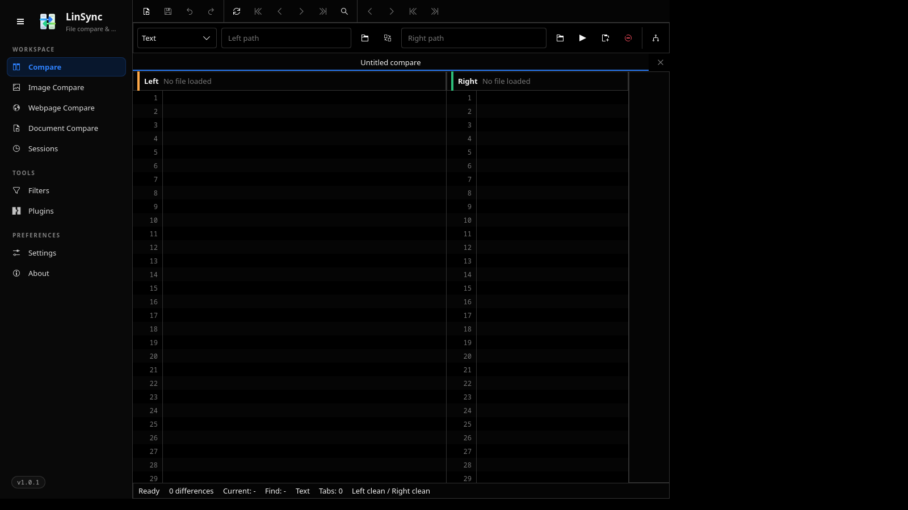

<p align="center">
  
</p>

<h1 align="center">LinSync</h1>

<p align="center">
  <b>The modern, customizable Linux diff &amp; merge experience.</b>
  <br />
  Compare files and folders — plus images, documents, tables, and web pages — side by side.
  <br />
  Fast Rust core · KDE-native Qt 6 / Kirigami UI · CLI + GUI · no telemetry · GPL-3.0-only.
</p>

<p align="center">
  <a href="https://github.com/visorcraft/LinSync/releases/latest"></a>
  <a href="LICENSE"></a>
  
  
  
</p>

---

## Screenshots

<p align="center">
  
  <br />
  <em>Text compare view. Real screenshots are captured by <code>scripts/gui-screenshot.sh</code>; the committed file is a placeholder pending a display-capable CI run.</em>
</p>

---

## What is LinSync?

LinSync is a desktop tool for the everyday "are these two things the
same?" question. Point it at two files or two folders and it shows you,
side by side, exactly what changed — line by line, byte by byte, or
entry by entry.

It is built around three goals:

- **Linux-native.** First-class FreeDesktop integration: Trash,
  `$XDG_*` paths, KDE-style settings, Dolphin service menu, AppImage /
  Flatpak / Arch / Debian / Fedora packaging.
- **Fast and offline.** A pure-Rust comparison engine (text, folder,
  binary, table, three-way merge) with no network calls and no
  telemetry.
- **Scriptable.** Every comparison the GUI does is also available as a
  `linsync-cli` subcommand with stable exit codes, JSON output, and a
  documented plugin protocol.

What it covers today:

- Text, folder, binary (hex), and CSV/TSV table compare.
- Image compare (exact, tolerance, perceptual / CIEDE2000).
- Document compare (PDF / DOCX / ODT) through plugin extractors
  (Tesseract OCR, Poppler, LibreOffice): text, OCR-text, and rendered
  (per-page image diff) modes.
- Webpage source HTML, extracted text, and resource-tree compare via
  the `webpage` CLI subcommand. Rendered DOM diff and screenshot diff
  are gated behind the `web-engine` Cargo feature and currently return
  `NotImplemented`.
- Three-way merge with conflict markers and a GUI Merge workspace.
- FreeDesktop Trash, named saved filters, recent sessions.
- Archive-as-folder compare for `.zip`, `.jar`, `.apk`, `.tar`,
  `.tar.gz`, `.tar.xz`, `.tar.zst`, … via the
  `linsync-cli archive` subcommand (and matching unpacker plugin
  scaffolds under `packaging/plugins/`).
- Plugin host with a Landlock + seccompiler + bubblewrap-fallback
  sandbox (`linsync-sandbox`).
- Local-only JSON bridge between the Qt UI and the Rust core (no
  cross-origin access, loopback only, signed token).

See [`docs/known-limitations-1.0.md`](docs/known-limitations-1.0.md)
for what is intentionally deferred.

---

## Setup (build from source)

LinSync uses a standard Cargo workspace.

**Prerequisites**

- Rust toolchain (pinned via `rust-toolchain.toml`).
- For the GUI: Qt 6 with QML and Kirigami available
  (`qt6-base`, `qt6-declarative`, `kirigami` on most distros), plus the
  `qml6` or `qml` runner.
- Optional for archive compare: `unzip`, `tar`.

**Build**

```sh
git clone https://github.com/visorcraft/linsync.git
cd linsync

just check   # cargo check --workspace
just test    # cargo test --workspace
just lint    # cargo clippy --workspace --all-targets -- -D warnings
just ci      # fmt + lint + test preflight
```

**Run from the source tree**

```sh
just run-cli compare a.txt b.txt
just run-gui                           # launches the Qt/Kirigami shell
cargo run -p linsync -- a.txt b.txt    # GUI with two paths preloaded
```

---

## Install

LinSync ships first-class packaging recipes under `packaging/`. Use the
one that matches your distro.

| Target            | Command                                                            |
| ----------------- | ------------------------------------------------------------------ |
| AppImage / AppDir | `just package` (writes to `target/AppDir`)                         |
| Arch / CachyOS    | `just package-arch` (runs `makepkg`)                               |
| Debian / Ubuntu   | `just package-deb` (runs `dpkg-buildpackage`)                      |
| Fedora / RHEL     | `just package-rpm` (runs `rpmbuild`)                               |
| Flatpak           | `flatpak-builder build packaging/flatpak/com.visorcraft.LinSync.yml`|

After install, LinSync registers a desktop entry
(`com.visorcraft.LinSync.desktop`), MIME associations
(`com.visorcraft.LinSync.mime.xml`), AppStream metainfo, hicolor icons,
and the Dolphin service menu.

The `linsync-cli` binary exposes shell completions:

```sh
linsync-cli completions bash > /etc/bash_completion.d/linsync-cli
linsync-cli completions zsh  > ~/.zfunc/_linsync-cli
linsync-cli completions fish > ~/.config/fish/completions/linsync-cli.fish
```

---

## Tweak

Settings live as JSON under `$XDG_CONFIG_HOME/linsync/`. Open them from
the GUI's **Settings → Open config folder** button or edit by hand:

```text
$XDG_CONFIG_HOME/linsync/settings.json   # theme, ignore rules, walk options
$XDG_CONFIG_HOME/linsync/filters.json    # named filters
$XDG_DATA_HOME/linsync/recent-paths.json # recent paths
$XDG_DATA_HOME/linsync/recent-sessions.json
$XDG_DATA_HOME/linsync/plugins/<id>/     # user plugins (see docs/plugin-protocol.md)
$XDG_STATE_HOME/linsync/linsync.log
```

Common knobs:

- **Theme, fonts, line numbers, whitespace, word-wrap:** Settings page.
- **Ignore case / whitespace / blank lines / EOL:** Settings page,
  applied to every new compare.
- **Walk options for folder compare (gitignore, follow symlinks, max
  depth, includes, excludes):** Filters page.
- **Named filters** (referenced from CLI via `--filter-name`):
  Filters page, validated with the bridge before save.
- **Plugins:** Plugins page; user plugins live under
  `$XDG_DATA_HOME/linsync/plugins/<id>/`.

Useful CLI knobs:

```sh
linsync-cli folders --recursive --exclude-generated \
  --filter 'wf!:*.lock' --filter-name 'Source only' left right
linsync-cli filter validate "wf:*.rs"
linsync-cli archive my-build.zip released-build.zip
linsync-cli compare3 --markers left.txt base.txt right.txt
```

Exit codes are stable: `0` = no differences, `1` = differences found,
`2` = error.

---

## Contribute

We love patches, bug reports, and design feedback. The full guide —
fork → branch → PR flow, coding standards, commit style, what we
require before review — lives in
[`CONTRIBUTING.md`](CONTRIBUTING.md).

Quick rules of thumb:

- Fork on GitHub, branch from `master`, send a PR.
- Run `just ci` locally before pushing — it must pass.
- LinSync is GPL-3.0-only. Do not paste code from other diff tools
  unless you have done a file-by-file licence review first
  (see [`docs/licensing.md`](docs/licensing.md)).

---

## Documentation

- [Changelog](CHANGELOG.md)
- [User guide](docs/user-guide.md)
- [Known limitations for 1.0](docs/known-limitations-1.0.md)
- [Engine decisions](docs/engine-decisions.md)
- [Plugin protocol](docs/plugin-protocol.md)
- [Settings storage decision](docs/settings-storage-decision.md)
- [Security](docs/SECURITY.md)
- [Licensing](docs/licensing.md)
- [Third-party notices](docs/third-party-notices.md)
- [Migrating from desktop diff tools](docs/migration-from-desktop-diff-tools.md)
- Full `docs/` directory: architecture, parity audits, packaging
  decisions, Qt bridge spike, FreeDesktop Trash design, and more.

---

## Licence

LinSync is licensed under the
[GNU General Public License v3.0 only](LICENSE).
